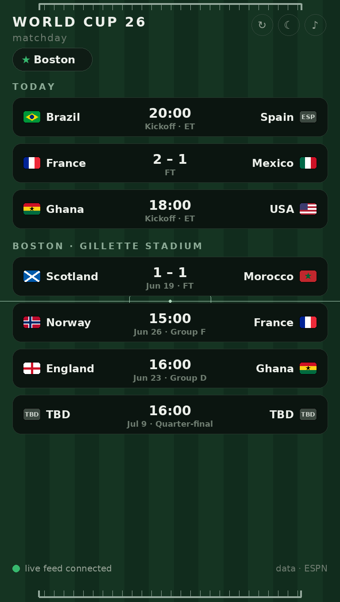
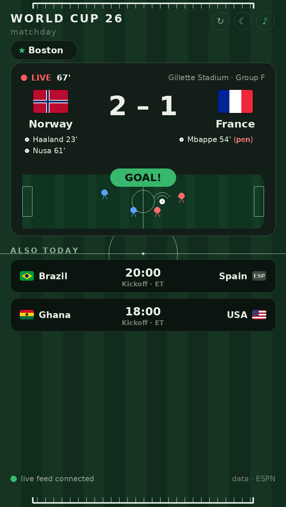
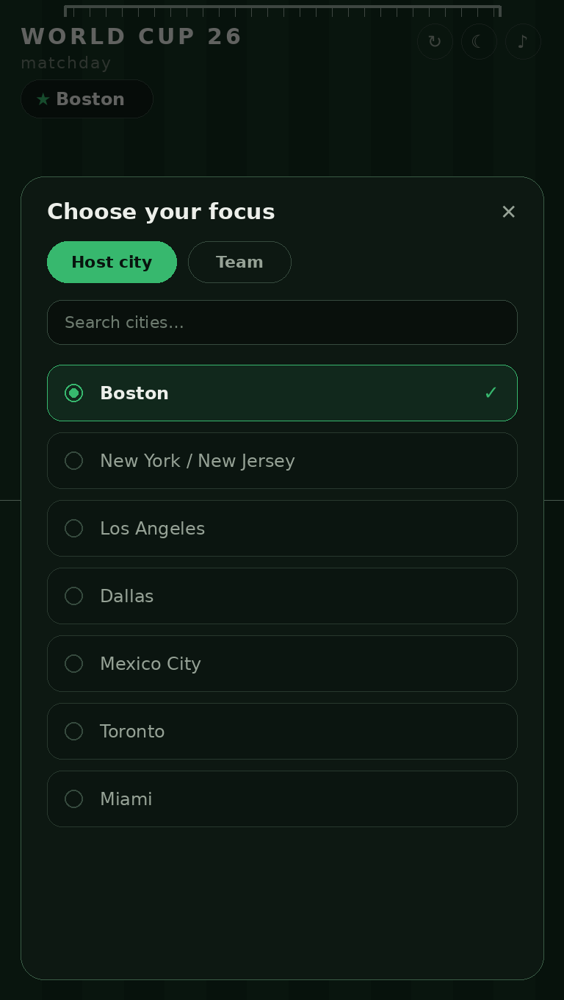

# World Cup 26 · Matchday

A tiny desktop widget for the 2026 FIFA World Cup. Today's matches with **live scores**, plus the **full schedule** for your favorite team or host city — in a small window that sits in the corner of your screen.

<table>
  <tr>
    <td align="center" width="33%"> <b>Today + your favorite</b></td>
    <td align="center" width="33%"> <b>Live match — pitch + GOAL!</b></td>
    <td align="center" width="33%"> <b>Pick a city or team</b></td>
  </tr>
</table>

## Open it

**Simplest — works everywhere, nothing to set up:** double-click **`fifa_widget.html`**. It opens in your browser and works exactly the same. (Want it as its own window with no tabs? In Chrome/Edge: **⋮ menu → Cast, Save, and Share → Install page as app** — or **Create shortcut** with *Open as window* ticked. Now it lives in your Dock/Start menu like an app, no Terminal involved.)

**Frameless "app window" launchers** (Chrome/Edge/Brave/Chromium — no tabs, no address bar). Keep all the files together in one folder.

| System | Double-click | First-launch setup |
|---|---|---|
| **Windows** | `run-windows.bat` | none — just double-click |
| **macOS** | `run-mac.command` | one-time only — see below |
| **Linux** | `run-linux.sh` | one-time only — see below |

**Why Mac/Linux need one step the first time:** unzipping strips the "executable" flag, and a file that isn't marked runnable can't start itself (so there's no in-file fix or password prompt that helps). Do this **once** and double-click works forever after, because the launcher re-marks itself executable on that first run:

> Open **Terminal**, type `bash` **and a space**, drag `run-mac.command` (or `run-linux.sh`) into the window, and press Return.

*Also available:* `python app.py` for a fully frameless native window (`pip install pywebview` once), or host the folder free on GitHub Pages.

## What you're looking at

- **Top — Today.** Every World Cup match happening today (U.S. Eastern), with a kickoff time, a **live score + minute** in red, or the **final score**.
- **Bottom — Your favorite.** The full schedule for the team or host city you've chosen — played matches with scores, upcoming ones with dates and venue.
- **When a match is live** it jumps to a **big panel up top** — big flags, full country names, the score, and **who scored (penalties marked)** — over a little pitch where both teams' players push toward the goals. The crowd gives a **roar when someone scores**; sound is **on by default** (it starts on your first click), and **♪** mutes it.
- **Tap the ★ chip** to switch your favorite — any of the 16 host cities or any team. Your choice is remembered next time.
- The whole board is a **football pitch** with **goalposts top and bottom**; when nothing is live there are no players, just the pitch. **☾ / ☀** follows your system theme (or flip it manually); **↻** forces a refresh.

## Good to know

- Scores come from **ESPN's public World Cup feed** (it carries live scorers and penalties), with **TheSportsDB as an automatic backup**, and the widget re-tries on its own if a fetch fails. Boston's schedule is built in, so something always shows even offline.
- Times are **U.S. Eastern**. Flags from flagcdn.com.
- Change the window size with `--window-size` in the launcher. Change your default favorite near `loadFocus()` in `fifa_widget.html`.

---

*Not affiliated with, endorsed by, or sponsored by FIFA — no FIFA marks or logos are used. MIT License.*
